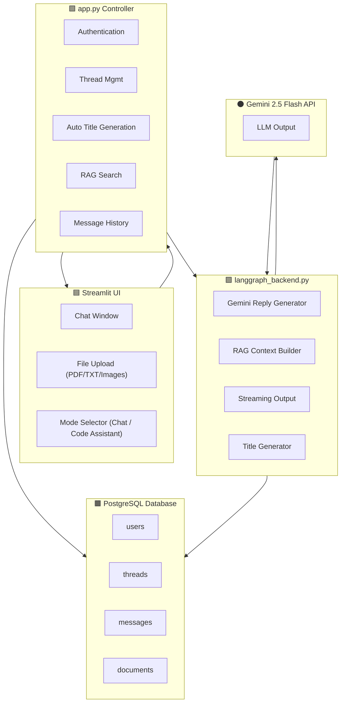

---

<p align="center">
  
</p>

---

# 🌐 **SmartLang — AI-Powered Multi-User Chatbot with RAG, File Uploads & Streaming Responses**

A modern, ChatGPT-style conversational AI built with **Streamlit**, **Gemini 2.5 Flash**, **PostgreSQL**, and **Retrieval-Augmented Generation (RAG)**.
It supports:

✅ Multi-user login
✅ Multiple isolated chat threads
✅ Auto-generated chat titles
✅ File uploads (PDF, TXT)
✅ Per-chat knowledge base
✅ RAG-enhanced replies
✅ Streaming responses
✅ Pin/unpin chats
✅ Chat deletion
✅ Code Assistant Mode
…and more!

This project is designed to feel like a **mini ChatGPT**, with additional features tailored to practical users, developers, and students.

---

## 🎥 Demo Video

<video width="100%" controls>
  <source src="Video Project.mp4" type="video/mp4">
</video>

---

# 🚀 **Features**

### 🧑‍💻 **1. Multi-User Authentication**

Each user has isolated chats, knowledge base, and messages.

### 💬 **2. Chat Threads (like ChatGPT)**

* Create unlimited chats
* Auto-title generation using Gemini
* Pin / unpin chats
* Delete chats with confirmation dialog
* Sidebar updates instantly

### 🧠 **3. Retrieval-Augmented Generation (RAG)**

Uploaded files become part of the chat’s **private knowledge base**.

Supports:

* PDF
* Text files

### 📁 **4. Per-Chat Knowledge Base**

Uploaded documents attach **only to that specific chat**—no mixing across chats.

Displayed cleanly on the right panel.

### 📄 **5. File Upload + Automatic Content Extraction**

* Auto-extracts PDF text
* Text preview added
* System message internally stored for RAG context

### ⚡ **6. Streaming AI Responses**

Responses appear word-by-word — fast & fluid.

### 👨‍💻 **7. Code Assistant Mode**

Switch between:

* **Chat Mode** (normal conversational AI)
* **Code Assistant Mode** (developer-focused responses)

### 📌 **8. Pin, Rename & Manage Chats**

Feels similar to ChatGPT’s UI.

### 🗑 **9. Clean Deletion Logic**

Deletes:

* Thread
* Messages
* Documents
  and updates sidebar **immediately**.

---

## 🏛️ Architecture Diagram



---

# 📂 **Project Structure**

```
📁 smartlang-chatbot/
│
├── app.py                    # Main UI app (Streamlit)
├── fetch.py                  # Database operations
├── langgraph_backend.py      # Gemini AI + streaming logic
├── .env                      # Secrets & DB config
├── requirements.txt
└── README.md
```

---

# 🔧 **Tech Stack**

| Component      | Technology                                |
| -------------- | ----------------------------------------- |
| UI             | **Streamlit**                             |
| AI Model       | **Gemini 2.5 Flash**                      |
| Backend        | Python                                    |
| DB             | **PostgreSQL**                            |
| RAG            | Custom File Embedding + Context Injection |
| Authentication | Custom DB-based login                     |
| File Parsing   | PyPDF2                                    |

---

# 🛠️ **Installation & Setup**

### **1. Clone the Repository**

```bash
git clone https://github.com/<your-username>/<repo>.git
cd <repo>
```

### **2. Create & Activate Virtual Environment**

```bash
python -m venv chatbot
chatbot\Scripts\activate
```

### **3. Install Dependencies**

```bash
pip install -r requirements.txt
```

---

# ⚙️ **Environment Variables (`.env`)**

Create a `.env` file:

```
GOOGLE_API_KEY=your_key_here

DB_HOST=localhost
DB_PORT=2114
DB_NAME=chatdb
DB_USER=postgres
DB_PASS=admin
```

---

# 🗄️ **PostgreSQL Setup**

Login to PostgreSQL client:

```bash
psql -U postgres -p 2114
```

Create database:

```sql
CREATE DATABASE chatdb;
```

Run schema:

```sql
CREATE TABLE users (
    id SERIAL PRIMARY KEY,
    username TEXT UNIQUE NOT NULL,
    password TEXT NOT NULL
);

CREATE TABLE threads (
    thread_id TEXT PRIMARY KEY,
    user_id INTEGER REFERENCES users(id),
    topic TEXT,
    pinned BOOLEAN DEFAULT FALSE,
    last_updated TIMESTAMP DEFAULT CURRENT_TIMESTAMP
);

CREATE TABLE messages (
    id SERIAL PRIMARY KEY,
    thread_id TEXT REFERENCES threads(thread_id),
    role TEXT,
    content TEXT,
    created_at TIMESTAMP DEFAULT CURRENT_TIMESTAMP
);

CREATE TABLE documents (
    id SERIAL PRIMARY KEY,
    thread_id TEXT REFERENCES threads(thread_id),
    title TEXT,
    content TEXT
);
```

---

# ▶️ **Run the App**

```bash
streamlit run app.py
```

Now open:

```
http://localhost:8501
```

---

# 🎯 **Usage Guide**

### **Create Account → Login**

Each user gets isolated:

* Chats
* Messages
* Files
* Knowledge base

### **Start a New Chat**

* Click **New Chat**
* Start typing
* Title auto-generates

### **Upload Files**

* PDF / txt files allowed
* Stored per chat
* Used for RAG context

### **Streamed Responses**

Every message is streamed token-by-token.

### **Delete Chat**

* Opens confirmation popup
* Removes thread + all messages

---

# 💡 **Future Enhancements (Optional)**

* Image understanding support
* Voice messages
* Shared team workspaces
* Real-time collaborative chat

---

# 🏁 **Conclusion**

SmartLang is a powerful, modern AI chatbot framework with:

✔ Real ChatGPT-like interface
✔ Multi-user support
✔ Document-aware responses
✔ Code assistant mode
✔ Fully scalable RAG architecture

This project is designed to be clean, extensible, and production-ready.

---